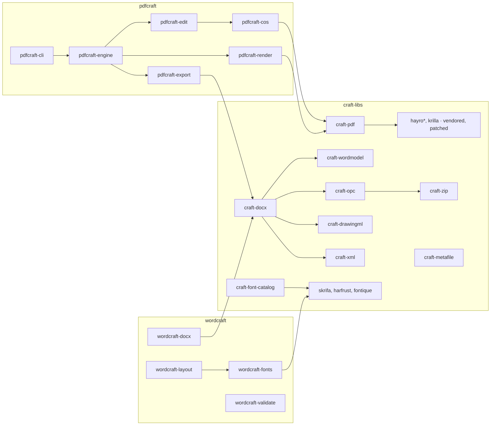

# Crate dependency graph (relevant subset)

Source: Report E §2. Edges are `[dependencies]` entries in each crate's Cargo.toml.

```mermaid
flowchart LR
  subgraph craft-libs
    CPDF[craft-pdf] --> HAY["hayro*, krilla · vendored, patched"]
    CDOCX[craft-docx] --> CWM[craft-wordmodel]
    CDOCX --> OPC[craft-opc] --> ZIP[craft-zip]
    CDOCX --> DML[craft-drawingml]
    CDOCX --> XML[craft-xml]
    META[craft-metafile]
    FCAT[craft-font-catalog] --> SKR[skrifa, harfrust, fontique]
  end
  subgraph pdfcraft
    PCOS[pdfcraft-cos] --> CPDF
    PEDIT[pdfcraft-edit] --> PCOS
    PREN[pdfcraft-render] --> CPDF
    PEXP[pdfcraft-export] --> CDOCX
    PENG[pdfcraft-engine] --> PEDIT & PREN & PEXP
    PCLI[pdfcraft-cli] --> PENG
  end
  subgraph wordcraft
    WDOCX[wordcraft-docx] --> CDOCX
    WLAY[wordcraft-layout] --> WF[wordcraft-fonts] --> SKR
    WVAL[wordcraft-validate]
  end
```
