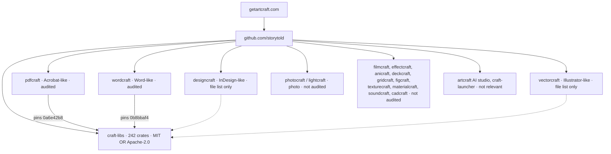

# ArtCraft ecosystem map

Source: Report A. Solid edges verified from manifests; dotted edges inferred.

```mermaid
flowchart TB
  SITE[getartcraft.com] --> ORG[github.com/storytold]
  ORG --> LIBS[craft-libs · 242 crates · MIT OR Apache-2.0]
  ORG --> PDF[pdfcraft · Acrobat-like · audited]
  ORG --> WORD[wordcraft · Word-like · audited]
  ORG --> DES[designcraft · InDesign-like · file list only]
  ORG --> VEC[vectorcraft · Illustrator-like · file list only]
  ORG --> PHO[photocraft / lightcraft · photo · not audited]
  ORG --> OTHER[filmcraft, effectcraft, anicraft, deckcraft, gridcraft, figcraft,<br/>texturecraft, materialcraft, soundcraft, cadcraft · not audited]
  ORG --> STUDIO["artcraft AI studio, craft-launcher · not relevant"]
  PDF -->|pins 0a6e42b8| LIBS
  WORD -->|pins 0b8bbaf4| LIBS
  DES -.-> LIBS
  VEC -.-> LIBS
```
