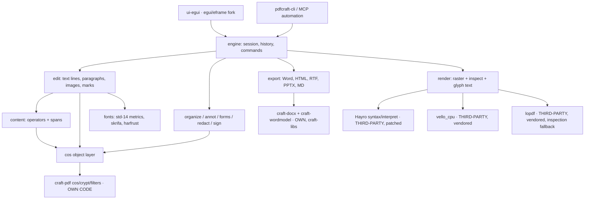

# PdfCraft subsystem diagram

Source: Report B §2. pdfcraft `c34c6c5a0bd8`, craft-libs `0a6e42b8`. Own code vs third-party is marked in node labels.

```mermaid
flowchart TB
  UI[ui-egui · egui/eframe fork] --> ENG[engine: session, history, commands]
  CLI[pdfcraft-cli / MCP automation] --> ENG
  ENG --> EDIT[edit: text lines, paragraphs, images, marks]
  ENG --> ORG[organize / annot / forms / redact / sign]
  ENG --> EXP[export: Word, HTML, RTF, PPTX, MD]
  ENG --> REN[render: raster + inspect + glyph text]
  EDIT --> CONT[content: operators + spans]
  EDIT --> COS[cos object layer]
  ORG --> COS
  CONT --> COS
  COS --> CPDF[craft-pdf cos/crypt/filters · OWN CODE]
  REN --> HAY[Hayro syntax/interpret · THIRD-PARTY, patched]
  REN --> VELLO[vello_cpu · THIRD-PARTY, vendored]
  REN --> LOPDF[lopdf · THIRD-PARTY, vendored, inspection fallback]
  EXP --> CDOCX["craft-docx + craft-wordmodel · OWN, craft-libs"]
  EDIT --> FONTS[fonts: std-14 metrics, skrifa, harfrust]
```
