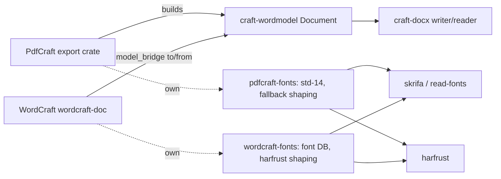

# What PdfCraft and WordCraft share

Source: Report C §7.

```mermaid
flowchart LR
  P[PdfCraft export crate] -->|builds| WM[craft-wordmodel Document]
  W[WordCraft wordcraft-doc] -->|model_bridge to/from| WM
  WM --> DX[craft-docx writer/reader]
  P -.own.-> PF[pdfcraft-fonts: std-14, fallback shaping]
  W -.own.-> WF[wordcraft-fonts: font DB, harfrust shaping]
  PF & WF --> SK[skrifa / read-fonts]
  PF & WF --> HR[harfrust]
```
