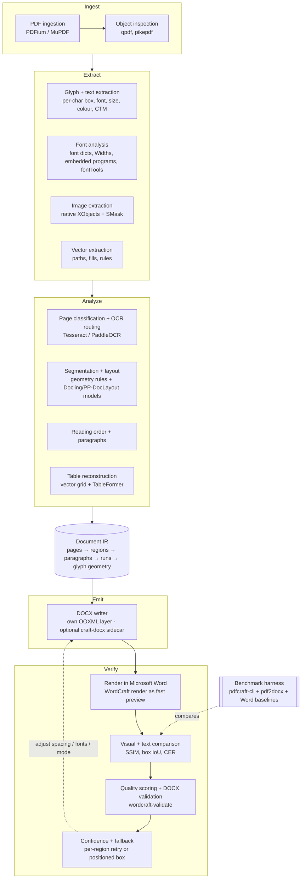

# Recommended PDF reconstruction architecture

Source: Report K §2.

```mermaid
flowchart TB
  subgraph Ingest
    A1[PDF ingestion<br/>PDFium / MuPDF] --> A2[Object inspection<br/>qpdf, pikepdf]
  end
  subgraph Extract
    B1[Glyph + text extraction<br/>per-char box, font, size, colour, CTM]
    B2[Font analysis<br/>font dicts, Widths, embedded programs, fontTools]
    B3[Image extraction<br/>native XObjects + SMask]
    B4[Vector extraction<br/>paths, fills, rules]
  end
  subgraph Analyze
    C1[Page classification + OCR routing<br/>Tesseract / PaddleOCR]
    C2[Segmentation + layout<br/>geometry rules + Docling/PP-DocLayout models]
    C3[Reading order + paragraphs]
    C4[Table reconstruction<br/>vector grid + TableFormer]
  end
  IR[(Document IR<br/>pages → regions → paragraphs → runs → glyph geometry)]
  subgraph Emit
    D1[DOCX writer<br/>own OOXML layer · optional craft-docx sidecar]
  end
  subgraph Verify
    E1[Render in Microsoft Word<br/>WordCraft render as fast preview]
    E2[Visual + text comparison<br/>SSIM, box IoU, CER]
    E3[Quality scoring + DOCX validation<br/>wordcraft-validate]
    E4[Confidence + fallback<br/>per-region retry or positioned box]
  end
  Ingest --> Extract --> Analyze --> IR --> D1 --> E1 --> E2 --> E3 --> E4
  E4 -.adjust spacing / fonts / mode.-> D1
  BENCH[[Benchmark harness<br/>pdfcraft-cli + pdf2docx + Word baselines]] -.compares.-> E2
```
